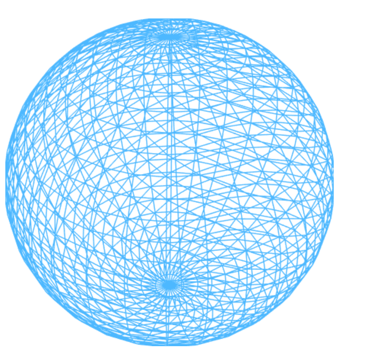
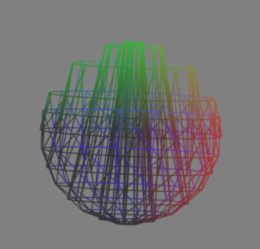
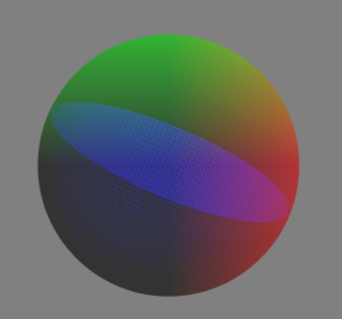
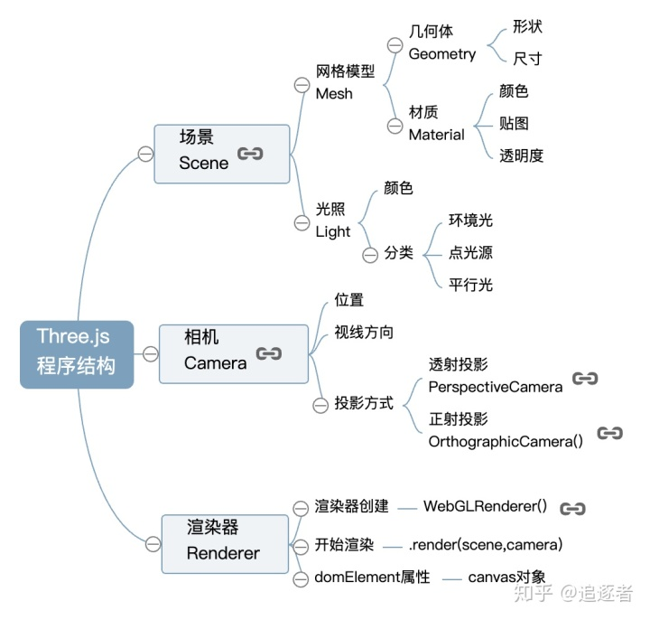

# 这是我们小组的成果
## 忘记报备做了地球
### 允许我们介绍我们的项目过程
#### 10月21日确定想做一个地球仪(带转的)

[第一步]
	我们想做地球仪需要一个球
	而且是一个三维的球,那么我们需要有一个构造球体的算法来计算球体面上均匀的点.
	> 所以我们有了两个构造的算法 
	>> <a href="demo1/index.html">demo1(瓦片式)</a>
	>> <a href="demo3/index.html">demo3(三角式)</a>

	但是实际上demo1 和 demo3 的构造算法都有一定的问题

	demo1 的 球体他不是封闭的就是在后期找到这个球体进行贴图覆盖的时候发现了缝隙,
	而且内部有一条首尾相连的线条,虽然不影响最终结果的展示但是,就是那么让人不安.
	
	https://blog.csdn.net/qq_37338983/article/details/78643772?ops_request_misc=%25257B%252522request%25255Fid%252522%25253A%252522161043281916780258022548%252522%25252C%252522scm%252522%25253A%25252220140713.130102334..%252522%25257D&request_id=161043281916780258022548&biz_id=0&utm_medium=distribute.pc_search_result.none-task-blog-2~all~baidu_landing_v2~default-1-78643772.first_rank_v2_pc_rank_v29&utm_term=webgl%20%E7%94%BB%E4%B8%80%E4%B8%AA%E7%90%83%E4%BD%93
	

**********
	demo2 的球体的问题在于他的点过于难找了,而且点分布不均匀,但是将密集度提升上去后效果还是圆润的的,

	(就是计算机在后期渲染的时候负担很大)

******

	在结束了球体构造问题的时候,我俩发现一个非常重要的问题,就是地球不是圆形的,是一个椭圆形!!!

	所以根据以下三个原则我们做出了非常重要的一个决定:

	✪ 地球模型构建：根据地球本身特性，构建逼近地球的椭球体三维模型。

	✪ 可视区域的确定：对经过视点与视窗中心的直线与地球模型求得交点，以交点为中心的一个正方形即是可视区域。

	✪ 可视瓦片的选取：根据可视区域视点相对于地球模型的位置确定一个最高分辨率，从第0级分辨率开始逐级向上剖分，
	选取可视瓦片列表。

******

# 渲染球体

	我们绘制模型是采用的三角形进行绘制的所以这里的圆其实是很多个三角形进行拼接拼上的

******

# 阶段分析:

	学会创建并渲染一个球体之后，我尝试实现一个简易的瓦片式地球仪。最初的想法是通过Google Static Map API获取纹理数据，但是我很快发现，Google Static Map API不能指定获取图片边缘的经纬度，只能以中心点经纬度和放大缩小等级来指定纹理位置。
	
	https://www.cnblogs.com/psunny/archive/2009/10/22/1588222.html

*****

# 相机 + 3d 渲染 

	场景——相机——渲染器：立方体网格模型和光照组成了一个虚拟的三维场景,
	相机对象就像生活中使用的相机一样可以拍照，只不过一个是拍摄真实的景物，一个是拍摄虚拟的景物，
	拍摄一个物体的时候相机的位置和角度需要设置，虚拟的相机还需要设置投影方式，
	当创建好一个三维场景，相机也设置好，
	就差一个动作“咔”，通过渲染器就可以执行拍照动作。

## 创建场景

	THREE.Scene 对象是所有不同对象的容器，
	也就是说该对象保存所有物体、光源、摄像机以及渲染所需的其他对象。

## 参考资料
	https://github.com/AnalyticalGraphicsInc/cesium 
	https://cloud.maptiler.com/maps/hybrid/cesium
	https://js.arcgis.com/4.10/esri/copyright.txt
	http://get.webgl.org/
	http://39.104.75.125:8080/FreeServer/index.html#/FreeXGis
	https://blog.csdn.net/u011294404/article/details/53350421?utm_medium=distribute.pc_relevant.none-task-blog-OPENSEARCH-1.control&depth_1-utm_source=distribute.pc_relevant.none-task-blog-OPENSEARCH-1.control
	
# end
